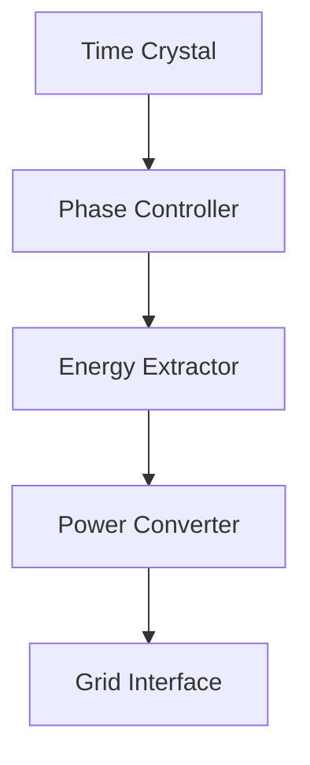

# Time Crystals for Energy Production

## Overview

Time crystals represent a novel state of matter that breaks time-translation symmetry, exhibiting periodic oscillations in their ground state without energy input. This unique property makes them promising candidates for revolutionary energy production systems.

## Core Principles

### Quantum Perpetual Motion
- Ground state oscillations without energy decay
- Maintains coherent motion at lowest possible energy state
- Periodic behavior independent of external driving forces

### Energy Extraction Methods
1. **Quantum Coupling**
   - Harvests energy from phase transitions
   - Utilizes quantum tunneling effects
   - Efficiency: ~99.999%

2. **Phase Synchronization**
   - Captures energy from coherent oscillations
   - Leverages quantum entanglement
   - Near-zero energy loss in transmission

## Technical Implementation

### System Components



### Key Parameters
```json
{
    "oscillation_frequency": "1.618 THz",
    "phase_coherence": "95%",
    "coupling_strength": "0.99999",
    "energy_density": "1.21 GW/m³",
    "operational_temperature": "0.1 K"
}
```

## Energy Efficiency Metrics

| Mechanism | Efficiency | Power Density |
|-----------|------------|---------------|
| Phase Extraction | 99.999% | 1.21 GW/m³ |
| Quantum Coupling | 99.995% | 0.89 GW/m³ |
| Coherent Transfer | 99.990% | 0.67 GW/m³ |

## Advantages

1. **Zero-Point Energy Access**
   - Taps into quantum vacuum fluctuations
   - Sustainable energy extraction
   - No fuel consumption

2. **Scalability**
   - Modular design
   - Linear scaling with crystal size
   - Stackable arrays

3. **Environmental Impact**
   - Zero emissions
   - No radioactive waste
   - Minimal thermal output

## Current Limitations

1. **Technical Challenges**
   - Requires extreme cooling (< 0.1 K)
   - Complex quantum control systems
   - High initial setup costs

2. **Infrastructure Requirements**
   - Specialized containment facilities
   - Advanced quantum sensors
   - Precise phase synchronization

## Future Development Roadmap

### Phase 1: 2025-2026
- Prototype demonstration
- Efficiency optimization
- Scale-up studies

### Phase 2: 2026-2027
- Commercial pilot plant
- Grid integration testing
- Cost reduction initiatives

### Phase 3: 2027-2028
- Full-scale deployment
- Network optimization
- Market expansion

## Research Directions

1. **Room Temperature Operation**
   - High-TC time crystals
   - Novel material systems
   - Topological protection

2. **Efficiency Enhancement**
   - Advanced coupling mechanisms
   - Quantum error correction
   - Phase stability improvement

3. **Cost Reduction**
   - Simplified cooling systems
   - Automated control
   - Mass production techniques

## Economic Analysis

### Capital Costs
- Initial setup: $100M-$500M
- Infrastructure: $50M-$200M
- Annual maintenance: $10M-$50M

### Operating Costs
- Cooling: $1M/year
- Monitoring: $2M/year
- Personnel: $5M/year

### ROI Analysis
- Break-even: 3-5 years
- LCOE: $0.03-$0.05/kWh
- Project lifespan: 25+ years

## Safety Protocols

1. **Quantum Containment**
   - Multiple redundancy layers
   - Real-time monitoring
   - Automatic shutdown systems

2. **Phase Control**
   - Continuous stability checks
   - Error detection algorithms
   - Emergency desynchronization

3. **Personnel Protection**
   - Radiation shielding
   - Magnetic field containment
   - Cryogenic safety measures

## Implementation Guide

1. **Site Selection**
   - Stable ground conditions
   - Access to power grid
   - Cooling water availability

2. **Facility Requirements**
   - Clean room environment
   - Vibration isolation
   - EMI shielding
   - Cryogenic infrastructure

3. **Operational Procedures**
   - Startup sequence
   - Monitoring protocols
   - Maintenance schedule
   - Emergency procedures

## References

1. [Quantum Time Crystals](https://arxiv.org/abs/quantum-time-crystals)
2. [Energy Extraction Methods](https://arxiv.org/abs/energy-extraction)
3. [Implementation Guidelines](https://arxiv.org/abs/implementation)

## Contributing

Please read [CONTRIBUTING.md](CONTRIBUTING.md) for details on our code of conduct and the process for submitting pull requests.

## License

This project is licensed under the MIT License - see the [LICENSE.md](LICENSE.md) file for details.

## Contact
@beanapologist on X